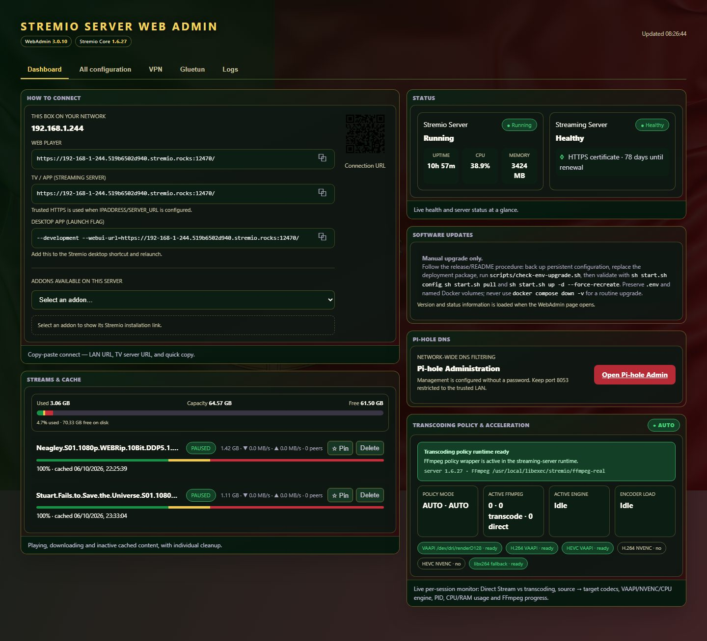
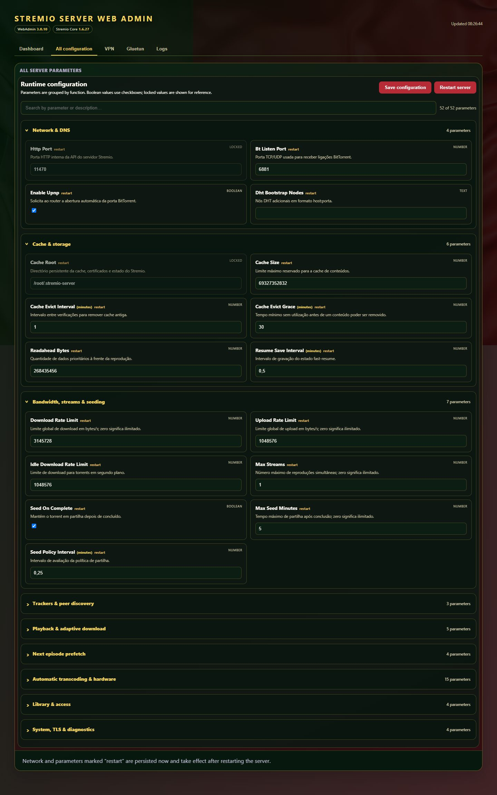
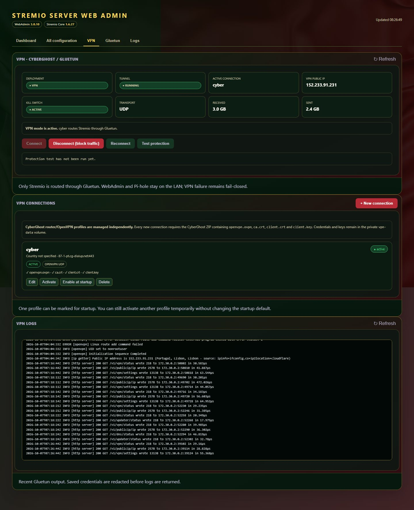
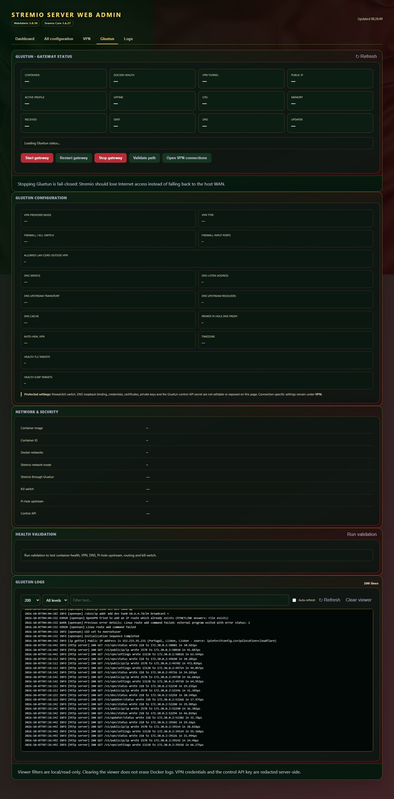
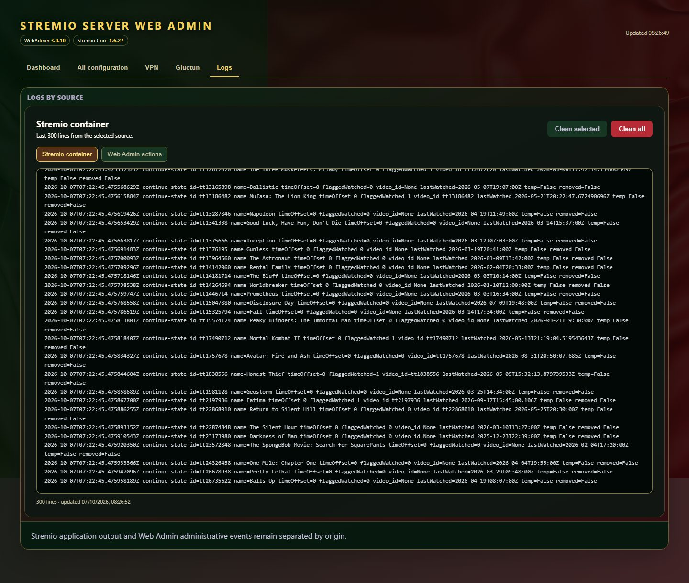

<div align="center">

# Stremio Server WebAdmin 3.0.13

### Self-hosted Stremio streaming with WebAdmin, GPU transcoding, VPN, Pi-hole and Library management

[](docs/releases/v3.0.13.md)
[](SERVER_VERSION)


[](compose.yaml)
[](#automatic-gpu-transcoding)
[](LICENSE)

**Run your own Stremio streaming backend with a browser-based administration interface, automatic hardware acceleration, optional VPN routing and integrated DNS filtering.**

[Quick Start](QUICKSTART.md) · [VPN Guide](VPN.md) · [Testing](docs/TESTING.md) · [Performance](docs/PERFORMANCE.md) · [Release Notes](docs/releases/v3.0.13.md)

</div>

---

<p align="center">
  
</p>

## ✨ Highlights

| | Capability | What it provides |
|---|---|---|
| 🖥️ | **Independent WebAdmin** | Browser dashboard for health, versions, configuration, restart operations, logs, cache and runtime diagnostics. |
| 🎬 | **Self-hosted Stremio Server** | Stremio/libtorrent streaming runtime with Web Player, API and HTTPS endpoints. |
| ⚡ | **Automatic GPU transcoding** | AUTO discovery of Intel/DRM VAAPI and NVIDIA/NVENC, with CPU-safe fallback. |
| 🌈 | **HDR-aware playback** | Validated HDR10/PQ/HLG → SDR VAAPI path when browser transcoding is required. |
| 📚 | **My Library** | Cached media catalog, Pin/Keep workflow and integration with Stremio playback continuity. |
| 🔐 | **Optional VPN** | Persistent Gluetun gateway with CyberGhost OpenVPN plus Proton WireGuard/OpenVPN profiles and Proton NAT-PMP port forwarding. |
| 🛡️ | **Pi-hole DNS** | Integrated DNS layer for Stremio, libtorrent and child processes. |
| 📊 | **Runtime observability** | Active streams, peers, cache, FFmpeg/transcoding state and component versions. |
| 🐳 | **Container-first deployment** | Coordinated Docker Compose topology with persistent configuration and release packages. |

## 🖥️ WebAdmin

WebAdmin is a separate service, so the administration interface can remain available while the Stremio server is restarted or recreated.

It exposes operational status, active streams, configuration, component versions, cache usage, VPN state and transcoding telemetry from one browser interface.

### Interface gallery

<table>
<tr>
<td width="50%"><b>All Configuration</b><br></td>
<td width="50%"><b>VPN</b><br></td>
</tr>
<tr>
<td width="50%"><b>Gluetun Gateway</b><br></td>
<td width="50%"><b>Logs</b><br></td>
</tr>
</table>

The screenshots above show the WebAdmin interface used by the 3.0.x release line. The current DEV baseline is validated against Stremio Core 1.6.34.

## 🚀 What makes this fork different?

This project is more than a container wrapper around the upstream server. It maintains a coordinated self-hosted streaming platform around the Stremio/libtorrent core.

### Automatic transcoding

Transcoding is **AUTO-only**. GPU availability never forces re-encoding: the Stremio core first decides whether the media can be copied directly or requires transcoding. Only then is the execution backend selected.

- Intel/DRM **VAAPI** discovery and runtime validation
- NVIDIA **NVENC** capability detection
- CPU-safe fallback when no validated accelerator is available
- H.264/HEVC hardware capability diagnostics
- live FFmpeg and playback telemetry
- equivalent HLS workload deduplication
- hardened transcode lifecycle and garbage collection

### HDR-aware browser playback

Media probing retains codec profile, pixel format, bit depth, transfer characteristics, colour primaries, HDR and Dolby Vision indicators.

When browser playback requires transcoding, validated HDR10/PQ/HLG sources can use hardware decode, VAAPI tone mapping to BT.709 and H.264 VAAPI encoding. Compatible SDR media can remain Direct Stream/copy.

### Embedded subtitles

Embedded subtitle tracks can be exposed to HLS clients as WebVTT renditions using finite extraction windows and timestamp mapping. Subtitle extraction is kept separate from the main video transcode and is not counted as another active video transcode.

### VPN + DNS integration

The Compose topology keeps Gluetun as a persistent network gateway. With VPN disabled the stack uses DIRECT egress; when VPN is enabled, the streaming traffic uses the configured tunnel with fail-closed protection. CyberGhost OpenVPN and Proton VPN (WireGuard/OpenVPN) profiles are supported. Proton NAT-PMP profiles can publish the provider-forwarded TCP/UDP BitTorrent port dynamically; while VPN is active, Core UPnP/NAT-PMP is disabled to avoid conflicting mappings.

Pi-hole is the normal DNS layer for the streaming stack in both modes.

### Library and playback continuity

The Library addon exposes cached content back to Stremio, supports Pin/Keep workflows and learns the relationship between Stremio media IDs and cached torrents. Playback position remains authoritative in Stremio Core rather than being duplicated in another progress database.

## 🔄 Upstream evolution and fork enhancements

The project tracks the upstream `stremio-libtorrent-server` Core while preserving WebAdmin and playback behaviour that has already been validated in this fork. Upstream changes are reviewed selectively: equivalent changes are aligned, stronger upstream implementations replace or improve ours, and fork-specific behaviour is retained when it provides broader functionality.

| Area | Core 1.6.34 evolution | This fork / WebAdmin | Integration policy |
|---|---|---|---|
| **Subtitles** | Adds stricter stream parsing and correct `fileIdx=-1` resolution. | Adds HLS WebVTT windows, timestamp rebasing, streaming extraction and resume-aware subtitle handling. | **Combined** — upstream `-1` semantics with the fork's richer HLS subtitle path. |
| **Library playback state** | Distinguishes torrents still being filled by playback from genuinely downloaded content. | Adds Watch/deep-link actions, Stremio metadata mapping, Continue Watching and cross-player continuity. | **Combined** — upstream state accuracy plus fork playback integration. |
| **Playback observability** | Core health and runtime status. | Adds `playbackActivity`, active sessions/streams and FFmpeg/transcoding visibility in WebAdmin. | **Fork enhanced** — retained as additional telemetry. |
| **Cache / Keep** | Improves disk headroom calculation and graceful cache-owner release. | Preserves Pin/Keep workflows and persistent cache management. | **Upstream improved** — adopted where safer and more accurate. |
| **TLS certificates** | Adds bounded certificate fetch, reuse, retry and `cert-status.json` health reporting. | Exposes health through the coordinated platform runtime. | **Upstream improved** — adopted in full while preserving fork startup patches. |
| **Transcoding** | Core remains authoritative for COPY vs TRANSCODE. | AUTO-only backend selection, VAAPI/NVENC/CPU fallback, HDR→SDR path and FFmpeg lifecycle controls. | **Fork enhanced** — upstream decision authority is preserved; the fork improves execution and observability. |
| **Continue Watching** | Uses the Stremio/Core playback model. | Patches player startup/deep-links and service-worker revisioning for App ↔ Web resume continuity. | **Fork enhanced** — retained because it covers the integrated Web Player workflow. |

This distinction is intentional: **Core version** identifies the upstream-derived server baseline, while **Platform/WebAdmin version** identifies the additional integration, administration, playback and deployment capabilities maintained by this project.

## 🧱 Runtime architecture

```text
                         Host / LAN
                             │
          ┌──────────────────┼──────────────────┐
          │                  │                  │
     Web Player          WebAdmin           Pi-hole
       :8080               :8090              :8053
          │                  │                  │
          └──────────────────┼──────────────────┘
                             │
                    Gluetun Gateway
                   DIRECT ↔ VPN egress
                             │
                 Stremio / libtorrent
                  :11470  :12470
                       :6881 TCP/UDP
                             │
                ┌────────────┴────────────┐
                │                         │
          Direct Stream             Transcoding
                                     AUTO backend
                                  VAAPI / NVENC / CPU
```

Disabling VPN stops the tunnel, not the gateway container. This keeps the Stremio network namespace stable when switching between DIRECT and VPN operation.

## ⚡ Quick start

### Requirements

- Linux host
- Docker Engine
- Docker Compose plugin
- `curl` or `wget` and `tar`/`unzip`
- writable installation directory such as `/opt/stremio-webadmin`

For production, use the deployment ZIP or TAR.GZ attached to the desired public GitHub release rather than cloning the complete development source tree.

```bash
mkdir -p /opt/stremio-webadmin
tar -xzf stremio-webadmin-<version>-deployment.tar.gz \
  -C /opt/stremio-webadmin --strip-components=1

cd /opt/stremio-webadmin
cp .env.example .env
sh start.sh
```

The launcher detects the host IPv4 address and supported GPU backend before applying the appropriate Compose topology.

For the complete installation procedure, configuration options and validation steps, see **[QUICKSTART.md](QUICKSTART.md)**.

## 🌐 Services

The launcher prints the detected host address and service URLs. With a host address such as `192.168.1.100`:

| Service | Default endpoint |
|---|---|
| Web Player | `http://192.168.1.100:8080` |
| WebAdmin | `http://192.168.1.100:8090` |
| Streaming API | `http://192.168.1.100:11470` |
| HTTPS / Stremio endpoint | `https://192.168.1.100:12470` |
| My Library | `https://192.168.1.100:12470/library/` |
| Pi-hole Web | `http://192.168.1.100:8053/admin/` |

The actual address is discovered from the host routing table and can be explicitly overridden when required.

## 🎮 Automatic GPU transcoding

Normal installations should keep automatic selection enabled:

```env
GPU_BACKEND=auto
VAAPI_DEVICE=
LIBVA_DRIVER_NAME=
TRANSCODING_MODE=auto
TRANSCODING_HWACCEL=auto
```

The decision flow is:

```text
Stremio Core
    │
    ├── compatible media ──────────────► Direct Stream / copy
    │
    └── transcode required
              │
              ▼
       AUTO backend discovery
          │       │       │
        VAAPI   NVENC    CPU
```

A detected GPU may legitimately remain idle when Stremio decides that video transcoding is unnecessary.

> On GPU hosts, use `start.sh` for upgrades/recreates. Running plain `docker compose up --force-recreate` can bypass automatic VAAPI/NVIDIA overlay selection.

## 🔐 VPN and Pi-hole

VPN is optional. A new installation can operate in DIRECT mode without a VPN profile.

Configure the VPN from **WebAdmin → VPN** and enable it when required. Disabling it returns the persistent gateway to DIRECT mode without recreating the Stremio network namespace.

Pi-hole remains integrated as the DNS layer. Publishing host DNS port 53 is optional and uses `compose.dns.yaml`.

See **[VPN.md](VPN.md)** for configuration and troubleshooting.

## 💾 Persistence and upgrades

Configuration and persistent state live outside the replaceable application containers. Routine image upgrades should therefore preserve local settings and data.

Before an upgrade:

```bash
sh scripts/backup-before-upgrade.sh
sh scripts/check-env-upgrade.sh
sh start.sh config
sh start.sh
```

Preserve the existing `.env` and persistent volumes. **Do not use `docker compose down -v` for a routine upgrade** unless deleting persistent data is intentional.

## 📦 Components

| Component | Development baseline |
|---|---:|
| Fork / Platform | **3.0.13** |
| WebAdmin | **3.0.13** |
| Upstream Server/Core | **1.6.34** |
| VPN Gateway image | **3.0.13** |

Versioning is intentionally independent: the platform/WebAdmin version identifies this fork, while the embedded Server/Core keeps its upstream-derived version.

## 📖 Documentation

| Document | Purpose |
|---|---|
| [Quick Start](QUICKSTART.md) | Installation, services, GPU setup and validation |
| [VPN Guide](VPN.md) | VPN profiles, DIRECT/VPN operation and troubleshooting |
| [Library UI](docs/library-ui.md) | My Library and addon behaviour |
| [Performance](docs/PERFORMANCE.md) | Performance diagnostics and test tooling |
| [Monitoring](docs/monitoring.md) | Runtime monitoring and metrics |
| [Testing](docs/TESTING.md) | Test suites and regression validation |
| [Clean Install Test](docs/CLEAN_INSTALL_TEST.md) | Clean deployment validation |
| [Deployment Package](docs/DEPLOYMENT_PACKAGE.md) | Supported release package surface |
| [Windows](docs/WINDOWS.md) | Windows-specific guidance |
| [Branching](docs/BRANCHING.md) | Repository branch model |
| [DevOps](docs/DEVOPS.md) | CI/CD and development operations |
| [Release notes](docs/releases/) | Detailed history by version |

## 🧪 Release engineering

The project separates fast CI, dependency checks, full regression, deployment-package validation and release promotion.

Only `main` and `development` are intended as long-lived development-repository branches. Feature, fix, release and documentation branches are temporary.

The public repository is the stable distribution surface; development and validation remain isolated from public releases.

## 🔗 Upstream

The Server/Core is based on the upstream **stremio-libtorrent-server** project and remains independently versioned. Fork-specific WebAdmin, VPN, Library, deployment and transcoding behaviour is maintained separately so it is not misrepresented as upstream functionality.

## ⚖️ Legal

This project is intended for self-hosted streaming infrastructure. Users are responsible for complying with applicable copyright, content-access, network and VPN-provider rules.

See [LICENSE](LICENSE) for the repository license.

---

<div align="center">

### Stremio Server WebAdmin

**Self-hosted. Observable. Hardware accelerated. VPN-ready.**

[Quick Start](QUICKSTART.md) · [Documentation](docs/) · [Release Notes](docs/releases/)

</div>
